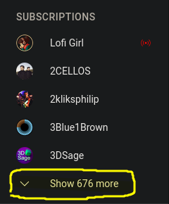

# scrape-subscriptions

Scrape your YouTube subscriptions in no time!

## Instructions:

1. Before running the script, go to your *[https://www.youtube.com/feed/subscriptions](https://www.youtube.com/feed/subscriptions)*
   
2. Click on ^ **"Show ### more"** in the lefthand sidebar
3. Use **CTRL+S** on your *[https://www.youtube.com/feed/subscriptions](https://www.youtube.com/feed/subscriptions)* as **subs.html**, then run the script!
